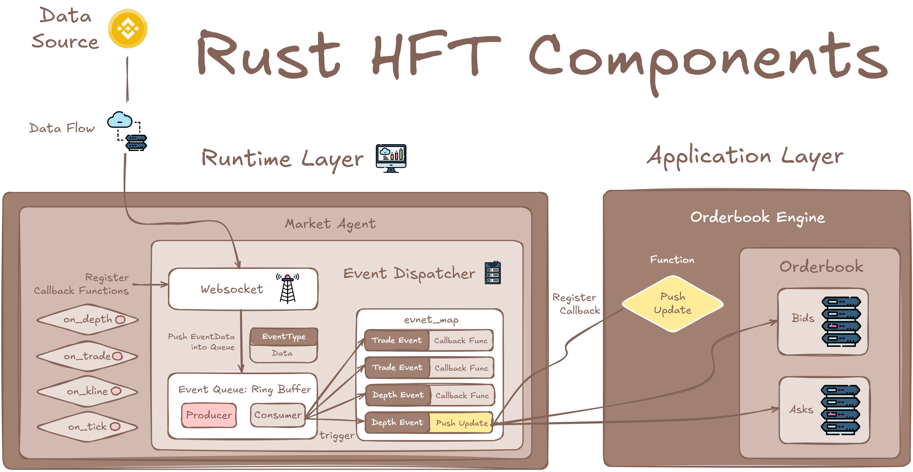

# Rust High-Frequency Trading Components

**Overview**  
This project includes high-frequency trading components developed in Rust for processing high-frequency orderflow data. It leverages an event-driven engine, asynchronous WebSocket based on Tokio, and SPSC ring buffer for acquiring, writing, and distributing market data in real time with microsecond-level system latency and millisecond-level internet latency. It also integrates the interactions with multiple exchanges, such as Binance, by offering encapsulated API interfaces and data parsing capabilities.
At the application layer, it provides an order book as an example, restructuring and maintenance module to efficiently manage and update order book data.
Moreover, the project offers Python API interfaces, allowing seamless integration and usage within Python code.

<p align="center">
  
</p>


---

**Features**

- **Event-Driven Architecture:** Utilizes an event-driven engine for robust and scalable real-time data handling.
- **WebSocket Integration:** Implements WebSocket for real-time market data acquisition.
- **Ring Buffer:** Efficiently leverages a ring buffer that operates lock-free and asynchronously in a Single Producer Single Consumer (SPSC) manner for optimal data storage and processing.

- **Exchange Adaptation:** Adapts to multiple exchanges (e.g., Binance) with dedicated interfaces for APIs and data parsing.
- **Order Book Maintenance:** Provides a component to maintain and update order book information.

---


**Prerequisites**
- CentOS
- rustc 1.85.0

**Installation and Usage**
1. Clone the Repository

   ```bash
   git clone git@github.com:eborlee/EborHFT.git
   cd eborhft

2. Build the Project

   Make sure you have Rust installed. Then run:

   ```bash
   cargo build --release

3. Run the Component

   Execute the compiled binary:

   ```bash
   cargo run --release
---
**Contributing**

Contributions are welcome! Please fork the repository and create a pull request with your proposed changes. Ensure your code adheres to our coding standards and includes relevant tests.
